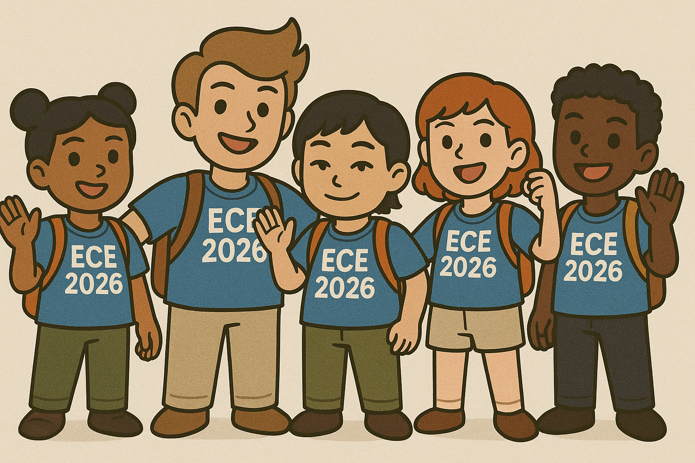

# Team_12_Terrier_Motorsport_Safety_System

<b> Meet the Team: </b>  
  Justin Nascimento, Hannah Faith Tandang, Alex Jones, Alberto Trejo, & "AJ" Chiaravalloti

  
    <b>About Us:</b>  
  
  
Our goal is to design and implement a digitized, Grounded-Low Voltage safety system for an F1-style electric vehicle that will shut the car down whenever one of the car’s sensors faults. We will complete circuit design, hardware implementation, signal processing, and more to create a fully functioning PCB system with both wired and wireless digital communications. The physical build of our system will utilize surface mount devices on custom made PCBs to minimize space, decrease weight, and improve energy-efficiency.
  
  

## Team links
- [Team Google Drive](https://drive.google.com/drive/folders/11_EBm_pFPGrHdL1etmQhd2uqvKe7Tddw?usp=drive_link)

## Course links
- [ECE Senior Design Piazza Site](https://piazza.com/bu/fall2025/ec463/home)
- [Blackboard](http://learn.bu.edu/)

## Optional features links
- Team Jira
- Team Confluence

